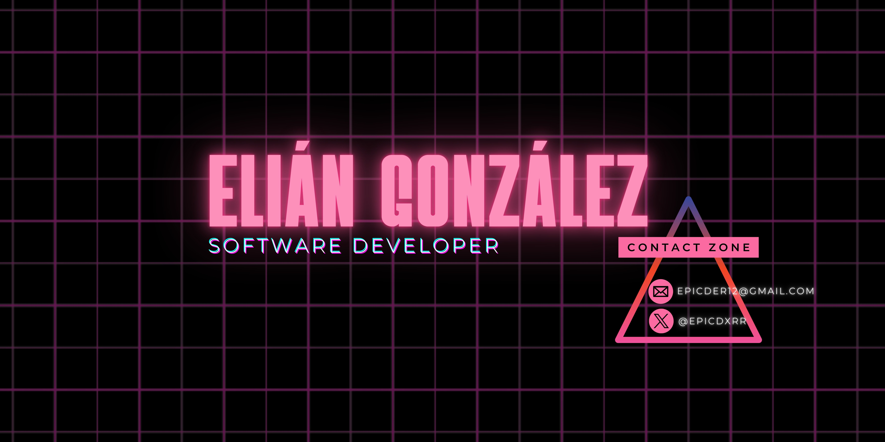

# Hello (world)! Im:

💬 About me:  
class Myself: 
‎‎‎‎‎‎‎‏‏‎ ‎‏‏‎  ‎‏‏‎ ‎‏‏‎ ‎‏‏‎ ‎def __init__(self): 
     ‎‏‏‎  ‎‏‏‎  ‎‏‏‎  ‎‏‏‎  ‎‏‏‎  ‎‏‏‎  ‎‏‏‎  ‎‏‏‎  ‎‏‏‎ ‎‏‏‎  self.name = "Elián" 
 ‎‏‏‎  ‎‏‏‎  ‎‏‏‎  ‎‏‏‎  ‎‏‏‎  ‎‏‏‎  ‎‏‏‎  ‎‏‏‎  ‎‏‏‎  ‎‏‏‎  ‎‏‏‎ self.age = 18 
 ‎‏‏‎  ‎‏‏‎  ‎‏‏‎  ‎‏‏‎  ‎‏‏‎  ‎‏‏‎  ‎‏‏‎  ‎‏‏‎  ‎‏‏‎  ‎‏‏‎  ‎‏‏‎ self.quote = "I will improve more and more everyday!" 
 ‎‏‏‎  ‎‏‏‎  ‎‏‏‎  ‎‏‏‎  ‎‏‏‎  ‎‏‏‎  ‎‏‏‎  ‎‏‏‎  ‎‏‏‎  ‎‏‏‎  ‎‏‏‎ self.im_dedicated = True 
 

# 👨‍💻 Technologies:
   

# 📊 GitHub Stats:

 

