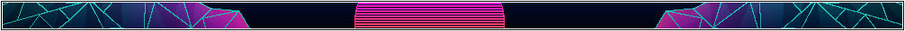

# Hello world! Im:

 
💬 About me:  

**Hi, I'm Elián!**
*I'm interested in blending* **creativity** *with* **tech**, *exploring artistic approaches and innovative solutions.* My goal is to *continuously develop* my skills and **leave a lasting impact** on the industry by *revolutionizing* areas where I can **make a difference**. 
Also, I *love* the **vaporwave aesthetic**, and I *care deeply* about the **artistic design** of things, so you'll probably encounter a lot of **vaporwave elements** in my projects! :p

🔎 Want to know more about my projects? Check out my portfolio here! https://epicder.tech
 

 

  

         

# 📊 GitHub Stats:

 

